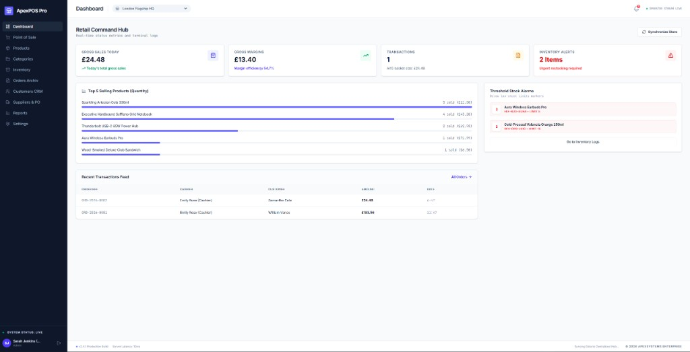
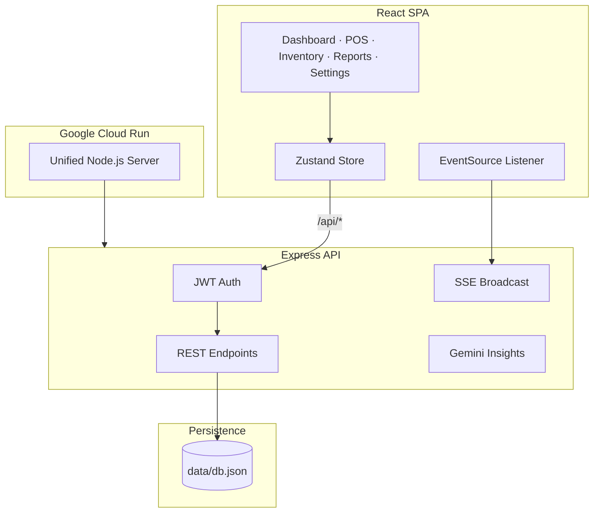

<div align="center">

# Apex POS & Inventory Management System

### Full-stack retail operations platform — POS checkout, multi-branch inventory, CRM, purchase orders, analytics & real-time alerts.

[](https://envault-sandbox-507307610839.europe-west2.run.app)
[](https://github.com/Vera93203/envault-sandbox)
[](https://nodejs.org/)
[](https://react.dev/)
[](https://www.typescriptlang.org/)
[](https://expressjs.com/)
[](https://tailwindcss.com/)
[](LICENSE)

**[Try the live app →](https://envault-sandbox-507307610839.europe-west2.run.app)** &nbsp;·&nbsp; [Features](#features) &nbsp;·&nbsp; [Quick Start](#quick-start) &nbsp;·&nbsp; [Demo Accounts](#demo-accounts) &nbsp;·&nbsp; [API Reference](#api-reference)

<br/>

<a href="https://envault-sandbox-507307610839.europe-west2.run.app">
  
</a>

<sub>Click the screenshot to open the live deployment on Google Cloud Run</sub>

</div>

---

## Live Demo

| | |
|---|---|
| **App URL** | [https://envault-sandbox-507307610839.europe-west2.run.app](https://envault-sandbox-507307610839.europe-west2.run.app) |
| **Hosted on** | Google Cloud Run (Europe West 2) |
| **Stack** | React 19 · Express · TypeScript · Tailwind CSS |
| **Login** | Use demo accounts below — one-click prefill on the login screen |

> Sign in as **Admin** (`admin@pos.com` / `admin123`) to explore the full dashboard, inventory controls, reports, and settings.

---

## Overview

**Apex POS** is a production-ready showcase of a modern retail management system. It unifies everything a store operator needs in one interface:

- **Point of Sale** — fast checkout with discounts, tax, loyalty points, and hold/recall
- **Multi-branch inventory** — stock levels, transfers, adjustments, and low-stock alerts
- **Supplier & PO workflow** — create purchase orders and receive stock into branches
- **Customer CRM** — profiles, loyalty balances, and transaction history
- **Analytics dashboard** — sales KPIs, margin tracking, top sellers, and 7-day charts
- **Real-time updates** — live SSE notifications for orders and stock events
- **Role-based security** — Admin, Manager, and Cashier access levels with JWT auth

The app ships with realistic seed data across **3 branches**, **6 products**, sample orders, customers, and suppliers — so every module is explorable from the first login.

---

## Features

### Retail Command Hub (Dashboard)
- Gross sales, margins, and transaction count for today
- Top 5 selling products with volume chart
- Threshold stock alarms with direct inventory links
- Recent transactions feed with cashier and customer details
- Multi-branch selector for consolidated or per-location views

### Point of Sale
- Product search by name, SKU, or barcode
- Cart management with per-item and order-level discounts
- Tax calculation from configurable business settings
- Cash, card, and split payment flows
- Hold / recall transactions
- Customer attachment and loyalty point accrual (£10 spent = 1 point)
- Real-time stock deduction on checkout

### Inventory Management
- Per-branch stock levels across all products
- Manual stock adjustments with audit trail
- Inter-branch stock transfers
- Low-stock alerts (threshold per product)
- Full stock movement history (sales, refunds, PO receipts, adjustments, transfers)

### Product & Catalog
- Product CRUD with SKU, barcode, pricing, and cost tracking
- Category management
- CSV bulk import
- Branch-level initial stock on product creation

### Orders & Refunds
- Complete order history with customer and cashier details
- Void / refund orders with automatic inventory restoration and loyalty reversal

### Suppliers & Purchase Orders
- Supplier directory
- Create purchase orders with line items
- Receive PO stock into branch inventory

### Customers (CRM)
- Customer profiles with contact details
- Loyalty points balance and transaction history

### Reports & AI Insights
- Financial analytics: gross sales, COGS, gross profit, inventory valuation
- 7-day sales volume chart
- Optional **Google Gemini AI** operational recommendations

### Administration
- Business settings (name, address, tax rate, currency, receipt footer)
- Staff user management (create, deactivate, assign roles and branches)
- Audit log of all critical actions

---

## Tech Stack

| Layer | Technology |
|-------|------------|
| **Frontend** | React 19, TypeScript, Tailwind CSS 4, Zustand, Lucide Icons, Motion |
| **Backend** | Express 4, TypeScript, JSON Web Tokens (JWT) |
| **Real-time** | Server-Sent Events (SSE) |
| **AI (optional)** | Google Gemini API (`@google/genai`) |
| **Build** | Vite 6, esbuild, tsx |
| **Deployment** | Google Cloud Run |
| **Data (current)** | JSON file store (`data/db.json`) with in-memory caching |
| **Data (planned)** | PostgreSQL via Prisma (`prisma/schema.prisma` included) |

---

## Quick Start

### Prerequisites

- **Node.js 20+** and **npm**

### 1. Clone the repository

```bash
git clone https://github.com/Vera93203/envault-sandbox.git
cd envault-sandbox
```

### 2. Install dependencies

```bash
npm install
```

### 3. Configure environment variables

```bash
cp .env.example .env
```

| Variable | Required | Description |
|----------|----------|-------------|
| `GEMINI_API_KEY` | No | Google Gemini API key for AI insights. Falls back to static recommendations if unset. |
| `JWT_SECRET` | No | Secret for signing auth tokens. **Change this in production.** |
| `NODE_ENV` | No | Set to `production` for the production build. |

### 4. Run locally

```bash
npm run dev
```

Open **[http://localhost:3000](http://localhost:3000)** — Express API and React UI run together on port **3000**.

### 5. Build for production

```bash
npm run build
npm start
```

---

## Demo Accounts

Use the **Fast Demo Prefills** buttons on the login screen:

| Role | Email | Password | Access |
|------|-------|----------|--------|
| **Admin** | `admin@pos.com` | `admin123` | Full access — settings, users, delete operations |
| **Manager** | `manager@pos.com` | `manager123` | Products, inventory, POs, reports, void orders |
| **Cashier** | `cashier@pos.com` | `cashier123` | POS checkout, view products & customers |

---

## Architecture



### Role-Based Access

| Action | Admin | Manager | Cashier |
|--------|:-----:|:-------:|:-------:|
| POS Checkout | ✅ | ✅ | ✅ |
| Dashboard & Reports | ✅ | ✅ | ✅ |
| Products & Categories | ✅ | ✅ | ❌ |
| Stock Adjust / Transfer | ✅ | ✅ | ❌ |
| Void / Refund Orders | ✅ | ✅ | ❌ |
| Suppliers & POs | ✅ | ✅ | ❌ |
| Settings & User CRUD | ✅ | ❌ | ❌ |
| Delete Records | ✅ | ❌ | ❌ |

---

## API Reference

All protected routes require `Authorization: Bearer <token>`.

<details>
<summary><strong>Authentication & Events</strong></summary>

| Method | Endpoint | Description |
|--------|----------|-------------|
| `POST` | `/api/auth/login` | Sign in, receive JWT |
| `GET` | `/api/auth/me` | Current user profile |
| `GET` | `/api/events` | SSE real-time event stream |

</details>

<details>
<summary><strong>Core Modules</strong></summary>

| Method | Endpoint | Description |
|--------|----------|-------------|
| `GET` | `/api/dashboard/stats` | Sales KPIs, alerts, top sellers |
| `GET` | `/api/products` | Products with branch stock |
| `POST` | `/api/pos/checkout` | Process a sale |
| `GET` | `/api/inventory/status` | Branch inventory snapshot |
| `POST` | `/api/inventory/adjust` | Adjust stock |
| `POST` | `/api/inventory/transfer` | Transfer between branches |
| `GET` | `/api/orders` | Order history |
| `POST` | `/api/orders/:id/void` | Refund an order |
| `GET` | `/api/reports/analytics` | Financial analytics |
| `POST` | `/api/ai/insights` | AI business recommendations |
| `GET` | `/api/settings` | Business configuration |

</details>

---

## Project Structure

```
envault-sandbox/
├── docs/images/
│   └── dashboard-preview.png   # README showcase screenshot
├── src/
│   ├── App.tsx                 # Layout, auth, navigation
│   ├── store.ts                # Zustand state (auth, cart)
│   ├── types.ts                # Shared TypeScript types
│   └── components/             # Dashboard, POS, Inventory, Reports…
├── server/
│   └── db.ts                   # JSON database + seed data
├── server.ts                   # Express API + Vite integration
├── prisma/schema.prisma        # PostgreSQL schema (planned)
└── docker-compose.yml          # Future production stack
```

---

## Available Scripts

| Command | Description |
|---------|-------------|
| `npm run dev` | Dev server (Express + Vite HMR) on port 3000 |
| `npm run build` | Production build (frontend + server bundle) |
| `npm start` | Run production server |
| `npm run lint` | TypeScript type-check |

---

## Roadmap

- [x] Full POS checkout with tax, discounts, and loyalty
- [x] Multi-branch inventory with transfers and audit trail
- [x] Purchase orders and supplier management
- [x] JWT auth with role-based access control
- [x] Real-time SSE notifications
- [x] Financial reporting dashboard
- [x] Google Cloud Run deployment
- [ ] PostgreSQL migration (Prisma schema ready)
- [ ] Password hashing (bcrypt / argon2)
- [ ] Receipt printing & barcode scanner support

---

## Contributing

1. Fork the repository
2. Create a branch: `git checkout -b feature/my-feature`
3. Commit: `git commit -m "Add my feature"`
4. Push and open a Pull Request

Run `npm run lint` before submitting.

---

## License

Licensed under the **Apache License 2.0** — see [LICENSE](LICENSE).

---

<div align="center">

**[View Live Demo](https://envault-sandbox-507307610839.europe-west2.run.app)** &nbsp;·&nbsp; **[GitHub Repository](https://github.com/Vera93203/envault-sandbox)**

Built for modern retail operations · Deployed on Google Cloud Run

</div>
